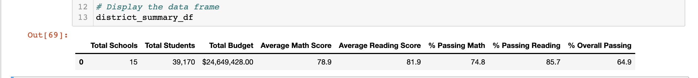

# School_District_Analysis
Deliverable 1: Replace ninth-grade reading and math scores

Deliverable 2: Repeat the school district analysis

Deliverable 3: A written report for the school district analysis (README.md)

## Overview of the school district analysis: 

After the main analysis which focused on math and reading scores performance.The School Board reviewed the data and suspects that the data for Thomas High School 9th graders have been alterted.Therefore, they have requested to null the math and reading scores for Thomas High School,9th grade class, while keeping the rest of the data intact.Once the math and reading scores have been replaced with NaNs we will begin the school district analysis again and compare to the original analysis with the 9th grade scores.

### The School District Analysis will include:

>- The district summary
>- The school summary
>- The top 5 and bottom 5 performing schools, based on the overall passing rate
>- The average math score for each grade level from each school
>- The average reading score for each grade level from each school
>- The scores by school spending per student, by school size, and by school type

### Resources

  1. Python version 3.7.6
  
  2. Jupyter Notebook 6.14
  
  3. Anaconda 4.8.3

  4. PythonData enviroment
  

# Results:

## **Specific Ask:**

### **How is the district summary affected?**

**Original Analysis:**

Although, we removed less than 500 test scores from the DataFrame the results for average math score, average reading score,%passing math, %passing reading and %overall passing remained relatively unchanged.The numbers would still round to the same whole number.This can be do to the large sample size used for the calculations.

**Updated data Analysis:**

### **How is the school summary affected?**

**Original Analysis:**

In the original analysis Thomas High School had a overall passing % of 91%.After removing the 9th grade scores and calculating the number of 10th-12th grade students and setting that as the new denominator we begin to test the data.When comparing with the original data Thomas High School overall passing % dropped from 91% to 65% a difference of 26%.The passing math % and passing reading % also decreased by approximately 20%.

**Updated data Analysis:**

### **How does replacing the ninth graders’ math and reading scores affect Thomas High School’s performance relative to the other schools?**

**Original Analysis:**

In the original analysis Thomas High School ranked 2nd in the district of 15 schools.After, replacing the ninth graders' math and reading score Thomas High School's performance and ranking declined to the 8th place.

**Updated data Analysis:**

### **How does replacing the ninth-grade scores affect the following:**

### **Math and reading scores by grade**

**Original Analysis:**

In the original analysis Thomas High School 9th grade had an average math score of 83.6 and average reading score of 83.7.The scores have been replaced by null values and shows up as NaN in the following charts.

**Updated data Analysis:**

### **Scores by school spending**

**Original Analysis:**

Thomas High School falls under the spending range(per student) of $630-$644.There was no change in the DataFrame overall.However,a small impact could be viewed by formatting the chart to the hundredths place.

**Updated data Analysis:**

### **Scores by school size**

**Original Analysis:**

Thomas High School falls under the medium size school(1000-2000).There was no change in the DataFrame overall.However, a small impact could be viewed by formatting the chart to the hundredths place.

**Updated data Analysis:**

### **Scores by school type**

**Original Analysis:**

Thomas High School falls under the charter school type.There was no change in the DataFrame overall.However, a small impact could be viewed by formatting the chart to the hundredths place. Its important to note once the values are rounded the values are the same.

**Updated data Analysis:**

### Summary: Summarize four changes in the updated school district analysis after reading and math scores for the ninth grade at Thomas High School have been replaced with NaNs.

1. The overall passing % for Thomas High School decreased dramatically from 91% to 65%.
2. Thomas High School overall ranking dropped from second place to the eight place in the district of 15 schools.
3. Math and reading scores for Thomas High School 9Th graders will show up as "NaN".
4. In addition to the overall passing %, the math and reading averages along with the passing percentages they all had a small shift.

